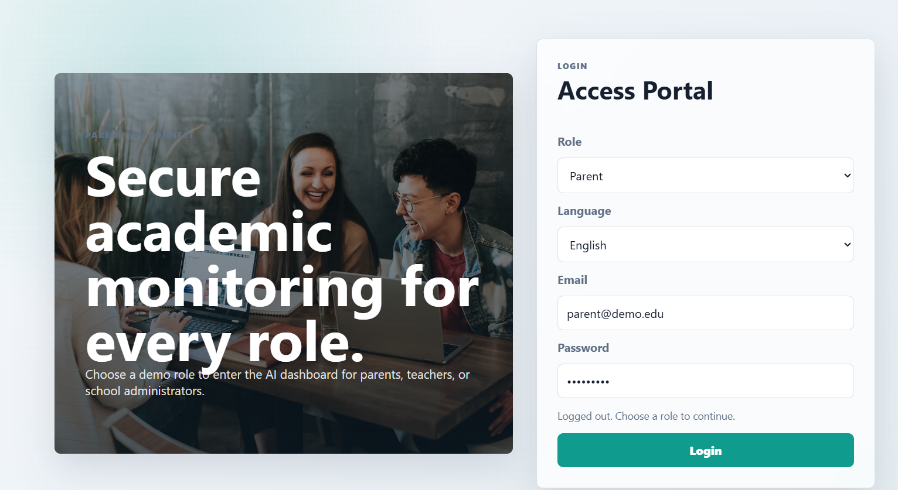
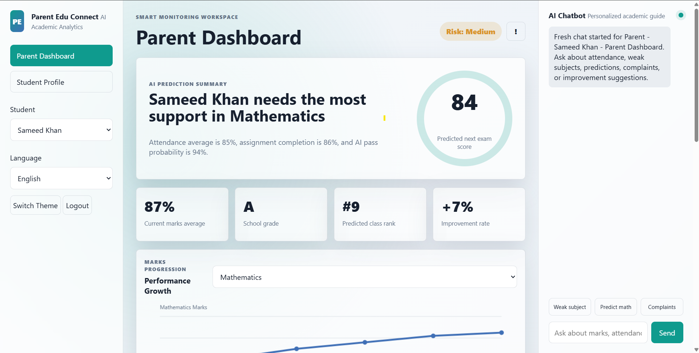
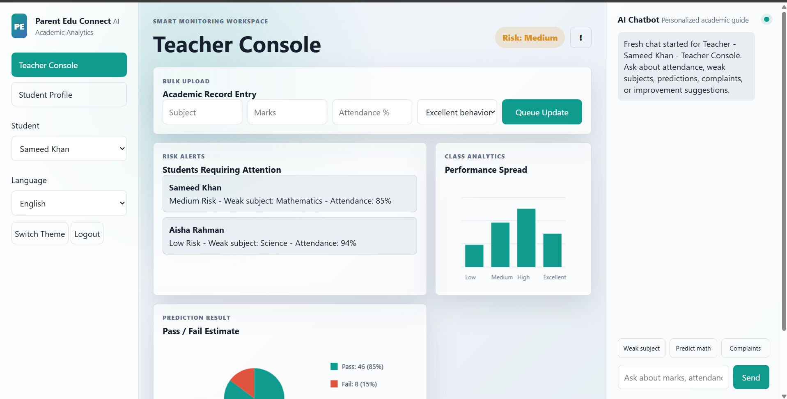
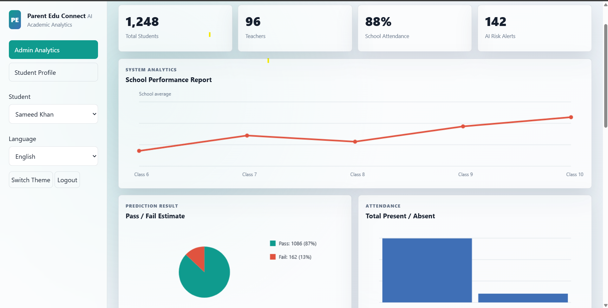
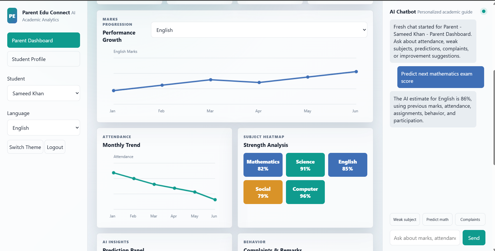
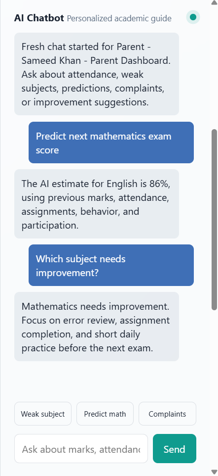
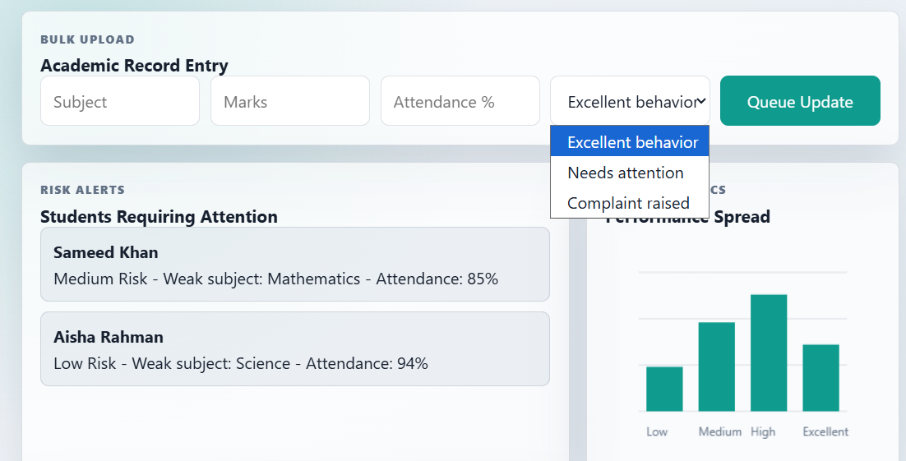
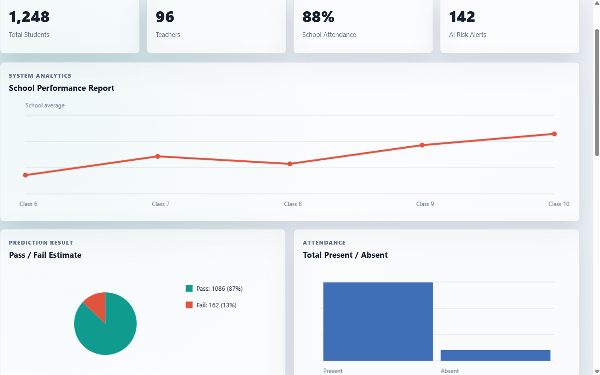
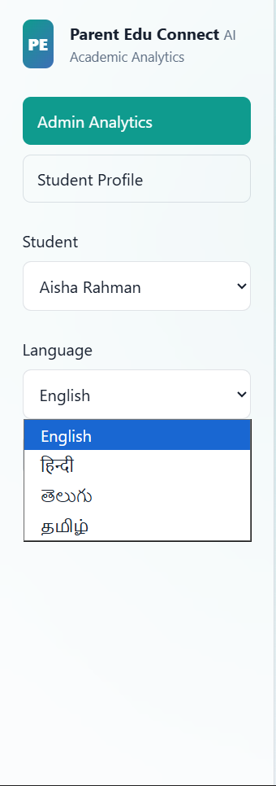

# Parent Edu Connect

<div align="center">

### AI-Powered Student Monitoring & Smart Academic Analytics System

A modern full-stack educational platform that empowers **Parents**, **Teachers**, and **Administrators** with real-time student monitoring, AI-driven academic insights, multilingual support, and intelligent performance prediction.


*A complete AI-powered educational management system built using Java Spring Boot, Python Flask, MySQL, and Machine Learning.*

</div>

---

# Table of Contents

* Overview
* Features
* Tech Stack
* System Architecture
* Project Structure
* Database Modules
* REST API
* AI Prediction Engine
* Installation
* Screenshots
* Future Enhancements
* Author
* License

---

# Overview

**Parent Edu Connect** is a role-based educational management platform designed to strengthen communication between schools and parents through artificial intelligence.

The system enables teachers to manage academic records while allowing parents to monitor their child's performance, attendance, achievements, and behavioral progress in real time. Administrators gain access to analytics, audit logs, and school-wide statistics through an interactive dashboard.

The platform combines **Java Spring Boot**, **Python Flask**, **Machine Learning**, and **MySQL** to provide a scalable and intelligent academic monitoring solution.

---

# Features

## Secure Authentication

* Secure Login System
* Role-Based Access Control
* Parent Login
* Teacher Login
* Administrator Login
* Session Management
* Authentication Tokens

---

## Parent Portal

* View Student Profile
* Monitor Academic Performance
* Attendance Tracking
* Behavior Reports
* Achievement History
* AI Performance Prediction
* AI Chatbot Assistance

---

## Teacher Portal

* Student Record Management
* Subject-wise Marks Entry
* Attendance Management
* Behavior Logging
* Academic Report Updates
* Student Performance Analysis

---

## Administrator Dashboard

* School Analytics Dashboard
* User Management
* Login Audit Logs
* Active User Sessions
* School Statistics
* Overall Performance Monitoring

---

## AI-Powered Features

* Student Performance Prediction
* Academic Trend Analysis
* Rule-Based Performance Evaluation
* Machine Learning Prediction
* Weak Subject Detection
* Personalized Improvement Suggestions
* Intelligent AI Chatbot

---

## Student Management

* Student Profiles
* Marks Management
* Attendance Records
* Behavior Tracking
* Achievement Management
* Academic History
* Performance Reports

---

## Smart Analytics

* Student Analytics
* Attendance Analytics
* Marks Analytics
* School Statistics
* Login Monitoring
* Active Session Tracking
* Performance Dashboard

---

## Multi-Language Support

* Multiple Language Interface
* Dynamic Language Switching
* Improved Accessibility
* Better User Experience

---

## Modern User Interface

* Responsive Design
* Glassmorphism UI
* Mobile Friendly
* Interactive Dashboard
* Modern Navigation
* User-Friendly Experience

---

# Tech Stack

| Category | Technologies                       |
| -------- | ---------------------------------- |
| Frontend | HTML5, CSS3, JavaScript            |
| Backend  | Java Spring Boot                   |
| Database | MySQL                              |
| AI & ML  | Python, Flask, NumPy, Scikit-learn |
| ORM      | Spring Data JPA                    |
| API      | RESTful APIs                       |

---

# System Architecture

```text
                         Parents
                         Teachers
                     Administrators
                             │
                             ▼
                 HTML • CSS • JavaScript
                  Responsive Frontend UI
                             │
                             ▼
                 Java Spring Boot REST API
                             │
        ┌────────────────────┴────────────────────┐
        │                                         │
        ▼                                         ▼
   MySQL Database                        Python Flask AI
                                                │
                                                ▼
                           Performance Prediction
                           AI Chatbot
                           Academic Analytics
```

---

# Project Structure

```text
Parent-Edu-Connect/
│
├── backend/
│   ├── controller/
│   ├── service/
│   ├── repository/
│   ├── entity/
│   ├── config/
│   ├── resources/
│   └── pom.xml
│
├── python-ai/
│   ├── app.py
│   ├── predictor.py
│   └── requirements.txt
│
├── database/
│   ├── schema.sql
│   └── seed.sql
│
├── screenshots/
│
├── index.html
├── styles.css
├── app.js
├── start-all.bat
└── README.md
```

---

# Database Modules

* Users
* Students
* Marks
* Attendance
* Behavior Logs
* Achievements
* Login Audits
* Active Sessions
* School Statistics

---

# REST API

## Authentication

```http
POST /api/auth/login
POST /api/auth/logout
```

## Student APIs

```http
GET  /api/students
GET  /api/students/{id}
POST /api/records
```

## AI APIs

```http
GET  /api/predictions/{studentId}
POST /api/chat
```

## Administrator APIs

```http
GET /api/admin/stats
GET /api/admin/login-audits
GET /api/admin/sessions
```

---

# AI Prediction Engine

The AI engine analyzes multiple academic factors to estimate student performance.

### Input Parameters

* Subject Marks
* Attendance Percentage
* Academic Trends
* Behavioral Performance

### AI Output

* Performance Prediction
* Weak Subject Identification
* Improvement Suggestions
* Academic Trend Analysis
* AI Chatbot Assistance

---

# Installation

## Clone Repository

```bash
git clone https://github.com/your-username/Parent-Edu-Connect.git
cd Parent-Edu-Connect
```

---

## Configure Database

* Install MySQL
* Create the database
* Execute:

```text
database/schema.sql
database/seed.sql
```

---

## Run Backend

```bash
cd backend
mvn spring-boot:run
```

---

## Run AI Service

```bash
cd python-ai
pip install -r requirements.txt
python app.py
```

---

## Launch Application

Open

```text
index.html
```

or run

```text
start-all.bat
```

---

# Screenshots

## Login Page



---

## Parent Dashboard



---

## Teacher Dashboard



---

## Administrator Dashboard



---

## Student Performance Prediction



---

## AI Chatbot



---


## Student Records



---

## School Analytics Dashboard



---

## Multi-Language Support



---

# Future Enhancements

* Mobile Application (Android & iOS)
* Deep Learning-Based Prediction Models
* Email Notifications
* SMS Alerts
* Face Recognition Attendance
* Cloud Deployment
* PDF Report Generation
* Parent-Teacher Messaging
* Multi-School Management
* Interactive Data Visualization
* Advanced AI Recommendation Engine

---

# Author

**Sameed Shaik**

**B.Tech – Computer Science and Engineering**

Vel Tech Rangarajan Dr. Sagunthala R&D Institute of Science and Technology

---

# License

This project is developed for educational and academic purposes.

---

<div align="center">

### Built with Java • Spring Boot • Python • Flask • MySQL • Machine Learning

**If you found this project useful, don't forget to ⭐ the repository!**

</div>
